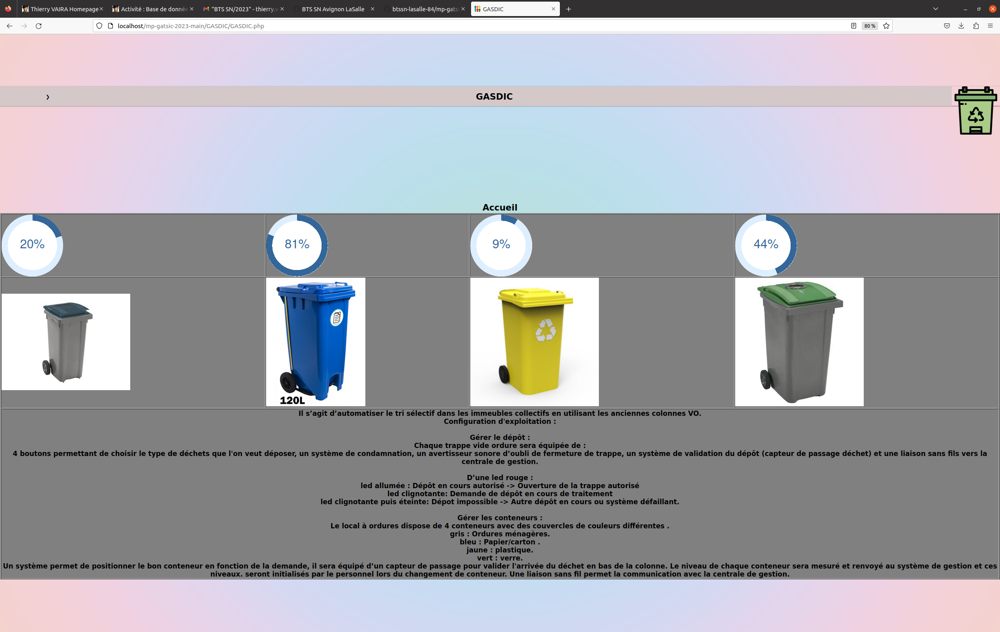

# Mini-projet GASDIC 2023

GASDIC est l'acronyme de **G**estion **A**utomatisée de la **S**élection des **D**échets en **I**mmeuble **C**ollectif. Il s’agit d’automatiser le tri sélectif dans les immeubles collectifs en utilisant les anciennes colonnes VO (vide ordure).

Il a pour but de réutiliser les conduits désaffectés tout en automatisant le système.

Chaque trappe vide ordure sera équipée de :

- 4 boutons permettant de choisir le type de déchets que l'on veut déposer.
- un avertisseur sonore d’oubli de fermeture de trappe.
- un capteur de passage déchet
- 3 leds :
    - vert : dépôt en cours autorisé -> ouverture de la trappe autorisé
    - orange : demande de dépôt en cours de traitement
    - rouge : dépot impossible -> autre dépôt en cours ou système défaillant.

Le local à ordures dispose de 4 conteneurs avec des couvercles de couleurs différentes :

- Jaune : recyclage plastique
- Vert : déchets ménagers
- Rouge : papier-carton
- Bleu/noir : boites métal

Un système permet de positionner le bon conteneur en fonction de la demande, il sera équipé d’un capteur de passage pour valider l'arrivée du déchet en bas de la colonne. Le niveau de chaque conteneur sera mesuré et renvoyé au système de gestion et ces niveaux seront initialisés par le personnel lors du changement de conteneur.

Auteur : MOUTTE Corentin

---
©️ LaSalle Avignon - 2023
